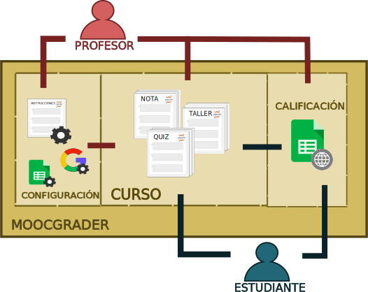

# Mooc-grader

### Descripcion
`Mooc-grader` es un `framework` diseñado para la implementación de `notebooks` en la elaboracion y calificacion de talleres (`PROBLEMSET`) y evaluaciones (`QUIZZES`) de un curso. La calificación se hace de manera automatica mediante el uso de calificadores o `graders` registrando las notas en una hoja de calculo de Drive compartida entre el tutor y el estudiante.

`Mooc-grader` cuenta con la siguiente arquitectura

### Maquina virtual
Al ser un framework orientado a estudiantes, se recomeinda usar la siguiente [maquina virtual](https://drive.google.com/open?id=1oSmoWvcs66cBiA6rQEaH74iZfYfwn9Br). La maquina presenta una configuracion que asegura el funcionamiento del framework, aparte de eso cuenta ya con una serie de herramientas listas para su uso.

### Uso
1. Descargar y Montar la maquina virtual.
2. Acceder mediante el navegador a `localhost:8002`. El puerto 8002 debe estar disponible.
3. Al acceder al puerto 8002 se abre un entorno [jupyter](http://jupyter.org/)
4. Abrir una terminal en jupyter y clonar el [repositorio](https://github.com/DaielChom/mooc-grader)
4. Inicar la elaboración del `curso`, es decir la implementacion del `framework`. Se debe elaborar la guia de [instrucciones](./instrucciones.ipynb).

### Dependencias
`mooc-grader` es un `framework` desarrollado en `python 2.7` y depende de las librerías documentadas en el archivo [dependencias.txt](./dependencias.txt)

### Instalación
Si se desea hacer una instalacion del framework sin la necesidad de la maquina virtual se recomienda usar un entorno de [Anaconda](https://anaconda.org/). Si no se desea usar anaconda se pueden seguir los siguientes pasos:

	~$ mkdir proyecto && cd proyecto

	~/proyecto$ git clone https://github.com/DaielChom/mooc-grader.git  
	~/proyecto$ cd mooc-grader
	~/proyecto$ sudo apt-get install python-pip python-dev libffi-dev libssl-dev libxml2-dev libxslt1-dev libjpeg8-dev zlib1g-dev
	~/proyecto$ sudo apt-get install lib32stdc++6
	~/proyecto$ sudo apt-get install libcairo2-dev
	~/proyecto/mooc-grader$ pip install -r dependencias.txt
	~/proyecto/mooc-grader$ jupyter notebook

	# Abrir el notebook instrucciones para empezar.

### Autores
`mooc-grader` fue ideado por:
* [@rramosp](https://sites.google.com/site/rulixrp/)
* [@famarcar](https://sites.google.com/site/fmartinezc21/)
